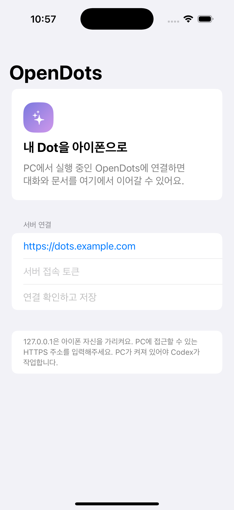

# OpenDots for iPhone + local Codex

An experimental native SwiftUI client for [OpenDots](https://github.com/CopilotKit/OpenDots),
bundled with a server adapter for your locally signed-in Codex CLI.
Chat with Dots, keep conversations, and save/edit Markdown pages on your iPhone.
Text chat in Codex mode needs no separate model API key; account eligibility and
Codex usage limits still apply.

**v0.1 experimental.** Tested with a Windows x64 PC, Node.js 24, Codex CLI
0.157.1, and a real iPhone over authenticated HTTPS. GitHub's macOS runners
build the iOS app without a local Mac. This is a sideloading prototype, not an
App Store or TestFlight release.

[한국어 설치 안내](docs/INSTALL.ko.md) · [English installation](docs/INSTALL.md)
· [Architecture](docs/ARCHITECTURE.md)



## Features

- Native iPhone/iPad screens (iOS 17+), without a WebView.
- Dot selection, saved chats, streaming replies, stop and recovery.
- Conversation-to-page saving, Space library, Markdown editing with revision checks.
- Endpoint-specific credentials in iOS Keychain.
- Local Codex app-server bridge and SQLite history.
- GitHub Actions simulator tests and unsigned device builds.

## Start on Windows

Install Git, PowerShell 7, and Node.js 24 LTS, then:

```powershell
git clone https://github.com/gksruf293/OpenDots-iOS.git
cd OpenDots-iOS
npm install -g @openai/codex@0.157.1
codex login
pwsh -File ./scripts/setup-server.ps1
pwsh -File ./scripts/start-server.ps1
```

The setup helper builds `server/`, binds to `127.0.0.1:4310`, and generates a
random owner token in ignored local files. Try the local website with the token
in `.local-tools/connection.txt`, then follow the installation guide for HTTPS
access and iPhone signing. The PC must remain running.

## Build the iPhone app

Fork the repo, enable Actions, and run **iPhone package (unsigned)**. Download
artifact **OpenDots-iPhone-Unsigned**. The IPA is a real device build but
**requires Apple signing before installation**. The guide covers Windows
AltServer and Mac/Xcode routes. Never put Apple credentials in CI.

## Development

```sh
cd server
npm ci
npm test
npm run lint
npm run typecheck
npm run build
```

Native development uses XcodeGen/Xcode, or the macOS Actions workflow. CI uses
mocked server protocol tests and native XCTest; no model account or signing
secrets are required.

## Scope and privacy

The Codex adapter provides text chat and page tools. Voice calls, managed Slack,
OpenBot computer tools, shell execution, push notifications, and multi-user
accounts are outside this release. HTTPS/token authentication is implemented;
end-to-end content encryption and an integrated relay are not. A tunnel
provider terminating TLS can see traffic.

Do not commit auth files, databases, conversation exports, signed profiles, or
personal connection screenshots. See [SECURITY.md](SECURITY.md).

## Credits

Based on CopilotKit/OpenDots. Its original MIT notice is retained in
`server/LICENSE`; additions are MIT-licensed. See [THIRD_PARTY_NOTICES.md](THIRD_PARTY_NOTICES.md).
Independently maintained; not affiliated with OpenAI, CopilotKit, Apple, ngrok,
or AltStore.
